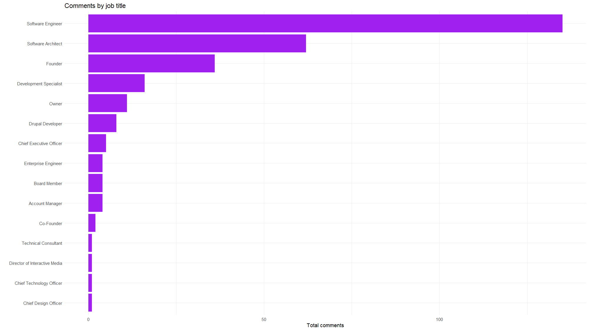

# LinkedIn data list

This repo contains a small Node.js script that consolidates loosely structured Excel data from LinkedIn. I created it as part of my final project for the class [DCAS 5331 - Social Media Analytics](https://journalism.unt.edu/academics/graduate/master-science-digital-communication-analytics.html). The following steps cover how to use the repo, as well as retrieving your initial data from LinkedIn.

---

## Setup

This presupposes that you already have [Node.js](https://nodejs.org) installed.

Clone this repo. Then run the install command from within the project directory. That will download all the necessary dependencies. It is worth noting that [SheetJS](https://docs.sheetjs.com) installs from their own hosting endpoint, because they prefer maintain it separately from NPM.

```bash
npm install
```

---

## Convert data

Run this command to invoke the script.

```bash
npm start
```

After which, you should see newly generated `*.csv` and `*.xlsx` files present in the `output` directory. Without any changes, the initial pass will use my example data from the `excel` directory. Replace those Excel files to consolidate your own LinkedIn data.

Input:

- `excel/PostAnalytics_UserName_7057749101953626112.xlsx`
- `excel/PostAnalytics_UserName_7058097033693315072.xlsx`
- `excel/etc…`

Output:

- `output/linkedin-data-list.csv`
- `output/linkedin-data-list.xlsx`

The CLI should log something akin to this.

```console
============
Example row:
============

{
  "post_date": "2025-04-26",
  "post_publish_time": "18:23",
  "impressions": 2101,
  "members_reached": 1252,
  "reactions": 75,
  "comments": 13,
  "reposts": 1,
  "employees_1_to_10": 0.0854632556438446,
  "employees_51_to_200": 0.11821085959672928,
  "employees_201_to_500": 0,
  "employees_501_to_1000": 0,
  "employees_1001_to_5000": 0.08785942196846008,
  "employees_5001_to_10000": 0,
  "employees_10001_or_more": 0.1645367443561554,
  "reactions_top_job_title": "Founder",
  "reactions_top_location": "Dallas-Fort Worth Metroplex",
  "reactions_top_industry": "Software Development",
  "comments_top_job_title": "Software Engineer",
  "comments_top_location": "Boise Metropolitan Area",
  "comments_top_industry": "Software Development",
  "post_url": "https://www.linkedin.com/feed/update/urn:li:ugcPost:7321962034693054465"
}

==================
New files created:
==================

• output/linkedin-data-list.csv
• output/linkedin-data-list.xlsx
```

> ⚠️ NOTE:
>
> - Make sure to delete my example files from the `excel` directory so you are parsing only your specific data.
> - Feel free to use mine for kicking the tires. But to get real utility from this script you will probably want your own info. If you simply add your files to mine, that will create an unrelated mishmash.

---

## Getting your data

To see a list of all your posts on LinkedIn — including reposts that are not first-party authored — go to this URL. Replace `YOUR_USER_NAME` with your actual user name.

`https://linkedin.com/in/YOUR_USER_NAME/recent-activity/all`

In my case, the URL looks like this. Yours will obviously be different.

https://linkedin.com/in/nathan/recent-activity/all

Hit your "page down" button several times. Eventually, you will run out of posts that contain a link with the text "view analytics." This is due to LinkedIn only retaining approximately a two-year rolling window of past data about posts.

Once you are reasonably certain there are no other posts that still have analytics available, paste this script the browser's JavaScript console in [dev tools](https://developer.chrome.com/docs/devtools/open). That will build an array of URLs. Open those one by one, and download your Excel files into the `excel` directory in this project. Then follow the "convert data" step listed above.

```javascript
(() => {
  // Get links.
  const linkList = document.querySelectorAll(".analytics-entry-point[href]");

  // Set later.
  const urlList = [];

  // Loop through.
  linkList.forEach((item) => {
    // Get URL.
    const url = item.getAttribute("href");

    // URL exists: YES.
    if (url) {
      // Add to list.
      urlList.push(`https://www.linkedin.com${url}`);

      /*
      =====
      NOTE:
      =====

        You can optionally enable this line. It may cause
        LinkedIn to rate limit your requests. It might be
        best to simply open each link manually to prevent
        being flagged as engaging in bot-like behavior.
      */
      // window.open(url);
    }
  });

  // Log array.
  console.log(urlList);
})();
```

---

## Example R usage

Beyond the scope of this repo, you might find it helpful to parse your collated Excel file using an app like [RStudio](https://en.wikipedia.org/wiki/RStudio). Scroll to the bottom of this document to see the R code that generated these example graphs.

[](/assets/readme/rstudio-grid-view.png)

---

Top posts by engagement

[](/assets/readme/top-posts-by-engagement.png)

---

Top posts by impressions

[](./assets/readme/top-posts-by-impressions.png)

---

Comments by job title

[](./assets/readme/comments-by-job-title.png)

---

Reactions by job title

[](./assets/readme/reactions-by-job-title.png)

---

Engagement by company size

[](./assets/readme/engagement-by-company-size.png)

---

Top locations by engagement

[](./assets/readme/top-locations-by-engagement.png)

---

➡️ This R code can be used to generate graphs.

```r
# ~~~~~~~~~~~~~~
# FILE PATH ----
# ~~~~~~~~~~~~~~

PATH_TO_EXCEL_FILE = "./output/linkedin-data-list.xlsx"

# ~~~~~~~~~~~~
# INSTALL ----
# ~~~~~~~~~~~~

install.packages("dplyr")
install.packages("ggplot2")
install.packages("readxl")
install.packages("scales")
install.packages("tidyr")
install.packages("tidytext")

library(dplyr)
library(ggplot2)
library(readxl)
library(scales)
library(tidyr)
library(tidytext)

# ~~~~~~~~~~~~~~~~~~~~~~
# WORKING DIRECTORY ----
# ~~~~~~~~~~~~~~~~~~~~~~

# Maybe not needed.
# setwd(dirname(getActiveDocumentContext()$path))

# ~~~~~~~~~~~~~~~~
# INGEST DATA ----
# ~~~~~~~~~~~~~~~~

# Get data.
li_data = read_excel(
  PATH_TO_EXCEL_FILE,
  sheet = "Sheet1"
)

# Peek at rows.
head(li_data)

# ~~~~~~~~~~~~~~~~~~~~~~~~~~~
# GRAPH: ENGAGEMENT RATE ----
# ~~~~~~~~~~~~~~~~~~~~~~~~~~~

# Get data.
li_data_engagement = li_data |>
  mutate(
    engagement_rate = (reactions + comments + reposts) / impressions,
    date_time = paste(post_date, post_publish_time)
  )

# Trim list.
top_posts_engagement = li_data_engagement |>
  arrange(desc(engagement_rate)) |>
  slice_head(n = 10)

# Graph.
ggplot(
  top_posts_engagement,
  aes(
    x = reorder(date_time, engagement_rate),
    y = engagement_rate
  )) +
  geom_col(fill = "steelblue") +
  geom_text(
    aes(
      label = round(engagement_rate * 100, 4)
    ),
    hjust = -0.1, color = "black"
  ) +
  labs(
    title = "Top posts by engagement",
    x = "",
    y = "Engagement rate %"
  ) +
  coord_flip() +
  theme_minimal()

# ~~~~~~~~~~~~~~~~~~~~~~~~~~~~~~~~~~~~~
# GRAPH: TOP POSTS BY IMPRESSIONS. ----
# ~~~~~~~~~~~~~~~~~~~~~~~~~~~~~~~~~~~~~

# Get data.
top_posts_impressions = li_data |>
  mutate(post_label = paste(post_date, post_publish_time)) |>
  arrange(desc(impressions)) |>
  slice_head(n = 10)

# Graph.
ggplot(top_posts_impressions, aes(x = reorder(post_label, impressions), y = impressions)) +
  geom_col(fill = "darkgreen") +
  coord_flip() +
  labs(
    title = "Top posts by impressions",
    x = "",
    y = "Impressions"
  ) +
  theme_minimal()

# ~~~~~~~~~~~~~~~~~~~~~~~~~~~~~~~~~~
# GRAPH: REACTIONS BY JOB TITLE ----
# ~~~~~~~~~~~~~~~~~~~~~~~~~~~~~~~~~~

# Get data.
job_title_reactions = li_data |>
  filter(!is.na(reactions_top_job_title)) |>
  group_by(reactions_top_job_title) |>
  summarize(total_reactions = sum(reactions, na.rm = TRUE), .groups = "drop") |>
  arrange(desc(total_reactions))

# Graph.
ggplot(
  job_title_reactions,
  aes(
    x = reorder(reactions_top_job_title, total_reactions),
    y = total_reactions
  )) +
  geom_col(fill = "orange") +
  coord_flip() +
  labs(
    title = "Reactions by job title",
    x = "",
    y = "Total reactions"
  ) +
  theme_minimal()

# ~~~~~~~~~~~~~~~~~~~~~~~~~~~~~~~~~
# GRAPH: COMMENTS BY JOB TITLE ----
# ~~~~~~~~~~~~~~~~~~~~~~~~~~~~~~~~~

# Get data.
job_title_comments = li_data |>
  filter(!is.na(comments_top_job_title)) |>
  group_by(comments_top_job_title) |>
  summarize(total_comments = sum(comments, na.rm = TRUE), .groups = "drop") |>
  arrange(desc(total_comments))

# Graph.
ggplot(
  job_title_comments,
  aes(
    x = reorder(comments_top_job_title, total_comments),
    y = total_comments
  )) +
  geom_col(fill = "purple") +
  coord_flip() +
  labs(
    title = "Comments by job title",
    x = "",
    y = "Total comments"
  ) +
  theme_minimal()

# ~~~~~~~~~~~~~~~~~~~~~~~~~~~~~~~~~~~~~~~~~
# GRAPH: EMPLOYEE COUNTS OF ENGAGEMENT ----
# ~~~~~~~~~~~~~~~~~~~~~~~~~~~~~~~~~~~~~~~~~

# Columns.
employee_cols = c(
  "employees_1_to_10",
  "employees_51_to_200",
  "employees_201_to_500",
  "employees_501_to_1000",
  "employees_1001_to_5000",
  "employees_5001_to_10000",
  "employees_10001_or_more"
)

# Get data.
employee_summary = li_data |>
  select(all_of(employee_cols)) |>
  pivot_longer(
    cols = everything(),
    names_to = "employee_category",
    values_to = "value"
  ) |>
  group_by(employee_category) |>
  summarize(total_value = sum(value, na.rm = TRUE), .groups = "drop") |>
  mutate(percentage = (total_value / sum(total_value)) * 100)

# Graph.
ggplot(
  employee_summary,aes(
    x = reorder(employee_category, percentage),
    y = percentage
  )) +
  geom_col(fill = "skyblue") +
  coord_flip() +
  labs(
    title = "Engagement by company size",
    x = "",
    y = "Percentage"
  ) +
  theme_minimal()

# ~~~~~~~~~~~~~~~~~~~~~~~~~~~~~~
# GRAPH: LOCATIONS OF USERS ----
# ~~~~~~~~~~~~~~~~~~~~~~~~~~~~~~

# Get data.
combined_locations = li_data |>
  select(reactions_top_location, comments_top_location) |>
  pivot_longer(
    cols = c("reactions_top_location", "comments_top_location"),
    names_to = "interaction_type",
    values_to = "location"
  ) |>
  filter(!is.na(location))

location_summary = combined_locations |>
  group_by(location) |>
  summarize(count = n(), .groups = "drop") |>
  arrange(desc(count))

# Graph.
ggplot(location_summary, aes(x = reorder(location, count), y = count)) +
  geom_col(fill = "dodgerblue") +
  coord_flip() +
  labs(
    title = "Top locations by engagement",
    x = "Location",
    y = "Count"
  ) +
  theme_minimal()
```
